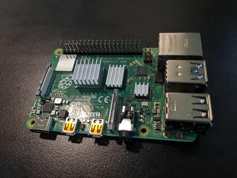
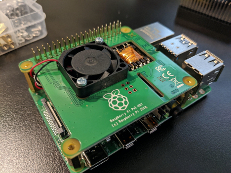
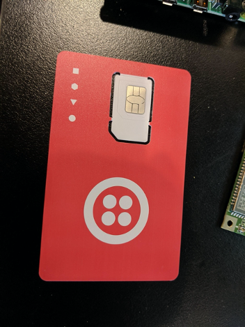
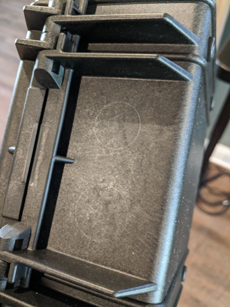
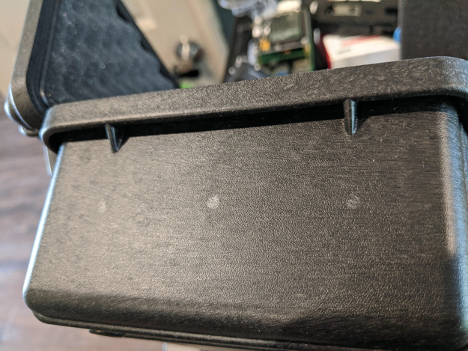
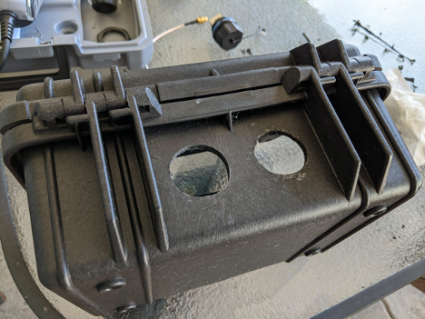
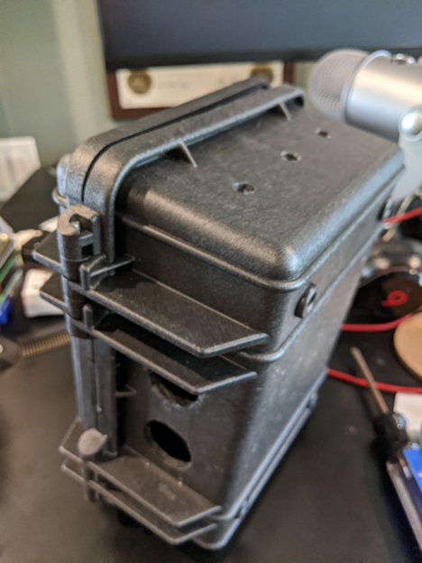
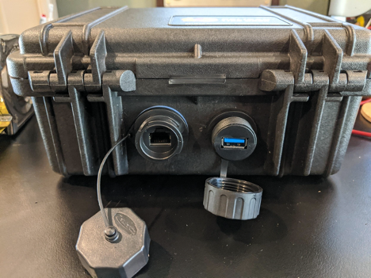
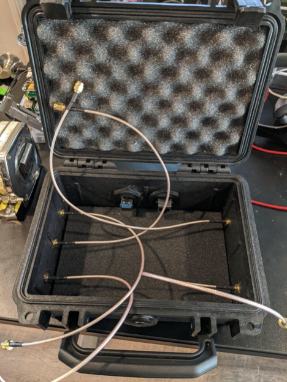
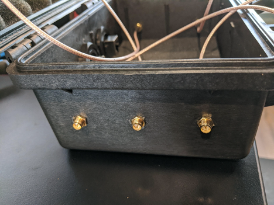

# Build Instructions

## Parts List
The following is the parts I used to build version 1. Use this as a guide as you may want to remove or replace these parts with better gear or parts that are available. All the parts should be pretty easy to find.

| Part               | Cost  | Amount | Total |
|--------------------|-------|--------|-------|
|[Pelican 1120 Case With Foam (Desert Tan)](https://www.amazon.com/gp/product/B0014D47RY/ref=ppx_yo_dt_b_asin_title_o05_s00?ie=UTF8&psc=1)|$38.36|1|$38.36 |
|[Raspberry Pi 4 Model B 2019 Quad Core 64 Bit WiFi Bluetooth (4GB)](https://www.amazon.com/gp/product/B07TC2BK1X/ref=ppx_yo_dt_b_asin_title_o04_s00?ie=UTF8&psc=1)|$62.00|1|$62.00|
|[Lexar Professional 1800x 64GB microSDXC UHS-II Card](https://www.amazon.com/gp/product/B07QM348D9/ref=ppx_yo_dt_b_asin_title_o05_s00?ie=UTF8&psc=1)|$39.99|1|$39.99|
|[Raspberry Pi 3G/4G-LTE Base HAT](https://sixfab.com/product/raspberry-pi-base-hat-3g-4g-lte-minipcie-cards/)|$39.99|1|39.99|
|[Quectel EC25 Mini PCle 4G/LTE Module - Sixfab](https://sixfab.com/product/quectel-ec25-mini-pcle-4glte-module/)|$49.99|1|$49.99|
|[LTE Main & Diversity & GNSS Triple Port u.FL Antenna - 100mm - Sixfab](https://sixfab.com/product/lte-main-diversity-gnss-triple-port-u-fl-antenna-100mm/)|$12.75|1|$12.75|
|[Panda Wireless PAU09 N600 Dual Band (2.4GHz and 5GHz) Wireless N USB Adapter W/Dual 5dBi Antennas - Windows XP/Vista/7/8/8.1/10, Mint, Ubuntu, openSUS](https://www.amazon.com/gp/product/B01LY35HGO/ref=ppx_yo_dt_b_asin_title_o09_s00?ie=UTF8&psc=1)|$34.99|2|$69.98|
|[SeeedStudio - Crazyradio PA - Long Range 2.4Ghz USB Radio Dongle With Antenna - DIY Maker Open Source BOOOLE: Computers & Accessories](https://www.amazon.com/SeeedStudio-Crazyradio-2-4Ghz-Dongle-Antenna/dp/B00VYA3A2U)|$34.00|1|$34.00|
|[Official Raspberry Pi Power Over Ethernet (PoE) HAT for Raspberry Pi 3 B+ and 802.3af PoE Network](https://www.amazon.com/gp/product/B07GR9XQJH/ref=ppx_yo_dt_b_asin_title_o05_s00?ie=UTF8&psc=1)| #30.00|1|$30.00|
| [Adafruit Accessories GPIO Stacking Header for Pi A+/B+/Pi 2 - Extra-long 2x20 Pins (1 piece): Electronics](https://www.amazon.com/gp/product/B00TW0W9HQ/ref=ppx_yo_dt_b_asin_title_o08_s00?ie=UTF8&psc=1)|$7.37|1|$7.37|
| [Bingfu RP-SMA Male to RP-SMA Female Bulkhead Mount RG316 WiFi Antenna Extension Coaxial Cable 30cm / 1 feet (2-Pack) for Wireless PCI Express PCIE Network Card WiFi Adapter WiFi Router Security Camera](https://www.amazon.com/gp/product/B07MT3VZXZ/ref=ppx_yo_dt_b_asin_title_o02_s00?ie=UTF8&psc=1)|$6.99|3|$20.97|
|[Boobrie 90 Degree RF Coaxial Coax Adapter RP SMA Male (Hole) to RP SMA Female (pin) Right Angle Connector for Audio FPV Antennas Radio Video Mobile Pack of 2: Computers & Accessories](https://www.amazon.com/gp/product/B07DC2374L/ref=ppx_yo_dt_b_asin_title_o04_s00?ie=UTF8&psc=1)|$5.50|2|$11.00|
|[SMAKN® M25 Waterproof USB3.0 Coupler](https://www.amazon.com/gp/product/B01JYLH2PG/ref=ppx_yo_dt_b_asin_title_o02_s03?ie=UTF8&psc=1)|$12.66|1|$12.66|
|[CNLINKO RJ45 Dual Port Ethernet Connector, Panel Mount Receptacles Socket Jack, Outdoor Waterproof IP67, Fast Data, Industrial: Electronics](https://www.amazon.com/gp/product/B073RZHPKS/ref=ppx_yo_dt_b_asin_title_o03_s02?ie=UTF8&psc=1)|$9.98|1|$9.98|
|[SaiTech IT 2 Pack Short Length 1 Feet USB 3.0 Extension Cable, USB 3.0 A Male to Female Extender Cable](https://www.amazon.com/gp/product/B077MFLH7W/ref=ppx_yo_dt_b_asin_title_o03_s00?ie=UTF8&psc=1)|$8.99|3|$26.97|
|[Superbat U.FL Cable 10cm/3.9” IPX (IPEX/UFL) Female to IPX (IPEX/UFL) Male RF Pigtail Cable 1.37mm Low-Loss U.FL Extension Cable Pack of 2: Home Audio & Theater](https://www.amazon.com/gp/product/B07PBDQ375/ref=ppx_yo_dt_b_asin_title_o09_s00?ie=UTF8&psc=1)| $6.99|2|$13.98|
|[eBoot 180 Pieces Male Female Hex Brass Spacer Standoff Screw Nut Assortment Kit (M2.5)](https://www.amazon.com/gp/product/B06XXV8RTR/ref=ppx_yo_dt_b_asin_title_o03_s01?ie=UTF8&psc=1)| $8.99|1|$8.99| 

- POE Riser 
- Battery 

## Initial Pi Setup 

### RaspberyPi 4

### RaspberyPi 4 & Hats

1. Attach any heatsinks you may have to RPi (Optional)
2. Attach 40-pin header to RPi
3. Attach 4-pin PoE Header pins

1. Attach spacers to RPi

1. Attach PoE hat to RPi headers

1. Break out SIM card

1. Insert SIM card into LTE hat
2. Attach Modem to LTE hat
3. Attach 40-pin header to PoE Hat
4. Attach spacers to PoE Hat
5. Attach LTE hat to 40-pin header on PoE hat

1. Attach Micro USB from LTE Hat to Pi USB port

1. Attach antenna to LTE hat making sure to be very careful about each connection type (LTE DIV, GPS, LTE Primary)

Case Build

1. Trace inner ring of ETH and USB rings

1. Drill USB/Eth Rings as well as five (5) Coax holes

1. Connect USB/Eth/Coax to Pelican Case

1. Connect USB hub to Pi
2. Connect the two (2) USB extension cables to the Pi, one to hub
3. Connect Panda Wireless cards to Pi USB cables and Crazy Radio to USB Hub cable
4. Situate Pi and cables into box
5. Connect Coax to wireless and crazy radio adapters
6. Connect WiFi antennas to Coax
7. Remove sticker coating from cellular antenna and apply it to the inside of the case.

OS Setup

1. Download Win32 Disk Imager
2. Write Kali Image to MicroSD card
3. Change default password - passwd command
4. Install LTE Hat / SIM Setup
  1. Register SIM card with service provider
  2. Apt-get update &amp;&amp; apt-get upgrade -y
  3. Install Raspberry Pi Kernel Headers? NO PACKAGE ON KALI
    1. sudo apt-get install raspberrypi-kernel-headers
  4. get [https://raw.githubusercontent.com/sixfab/Sixfab\_RPi\_3G-4G-LTE\_Base\_Shield/master/tutorials/QMI\_tutorial/qmi\_install.sh](https://raw.githubusercontent.com/sixfab/Sixfab_RPi_3G-4G-LTE_Base_Shield/master/tutorials/QMI_tutorial/qmi_install.sh)
  5. sudo chmod +x qmi\_install.sh
  6. Replace /home/pi with /root - sed -i &#39;s#/home/pi#/root#g&#39; qmi\_install.sh
  7. wget https://github.com/sixfab/Sixfab\_RPi\_3G-4G-LTE\_Base\_Shield/raw/master/tutorials/QMI\_tutorial/src/4.14.zip -O drivers.zip
  8. unzip drivers.zip -d /root/files/ &amp;&amp; rm -r drivers.zip
  9. ./qmi\_install.sh
  10. Reboot
  11. cd /root/files
  12. sudo ./quectel-CM -s wireless.twilio.com (or your provider APN)
  13. ping -I wwan0 -c 5 8.8.8.8
5.
6.

Other Notes

Ralph needs to add 4-pin header for PoE connector to parts list

For SIM data on Twilio follow this for test SIM card: [https://pages.twilio.com/rs/294-TKB-300/images/Sixfab\_Twilio\_SIM\_Registration%20Instructions\_612020.pdf](https://pages.twilio.com/rs/294-TKB-300/images/Sixfab_Twilio_SIM_Registration%20Instructions_612020.pdf)

Other Possible Parts Needed

Rechargable Battery Pack

90 degree angle USB-C attachments

SIM card

4-pin header

2 USB to Eth Adapters

USB Hub

1-ft USB male-to-male cable

GPS